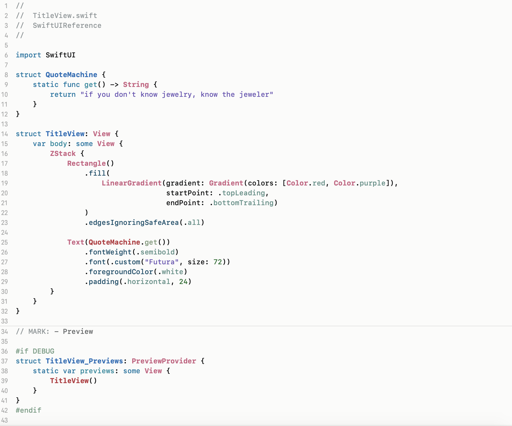
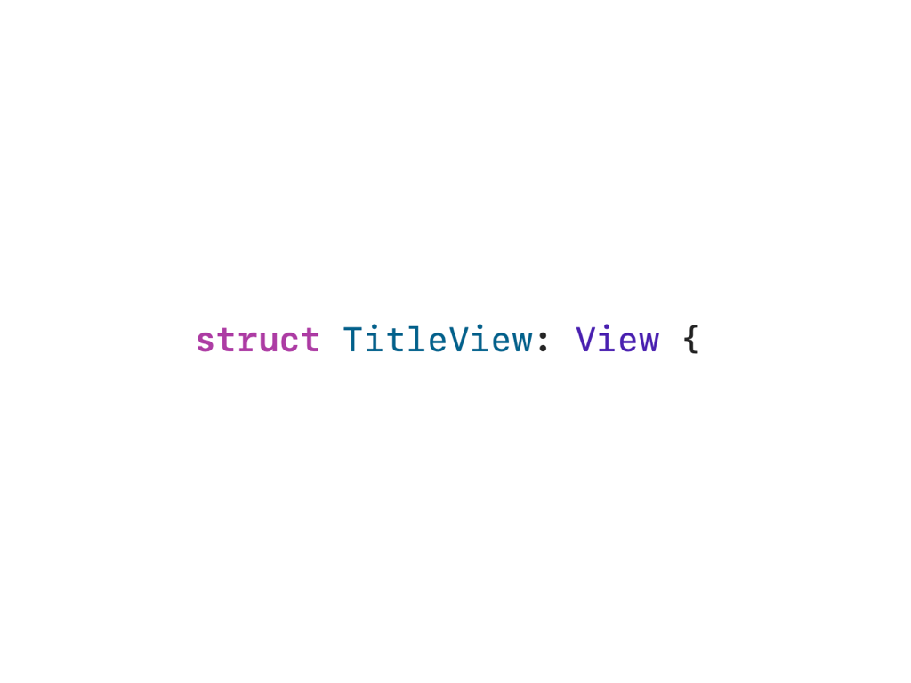
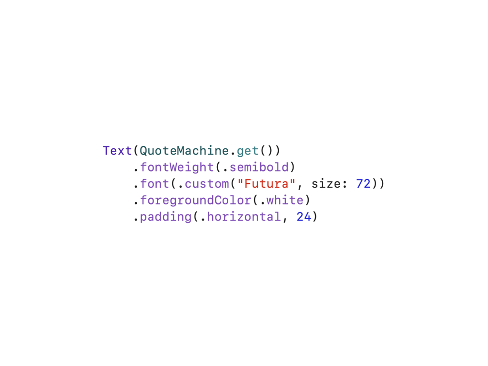
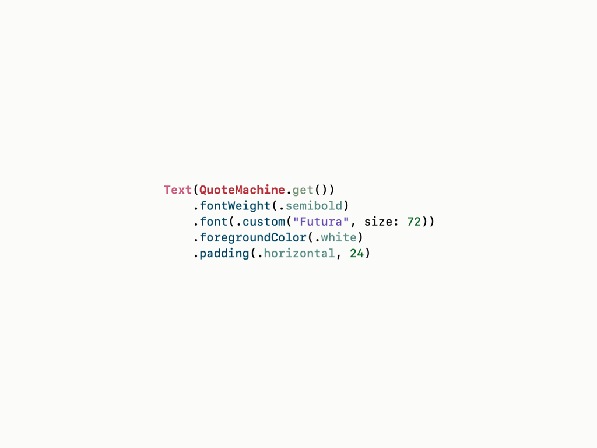
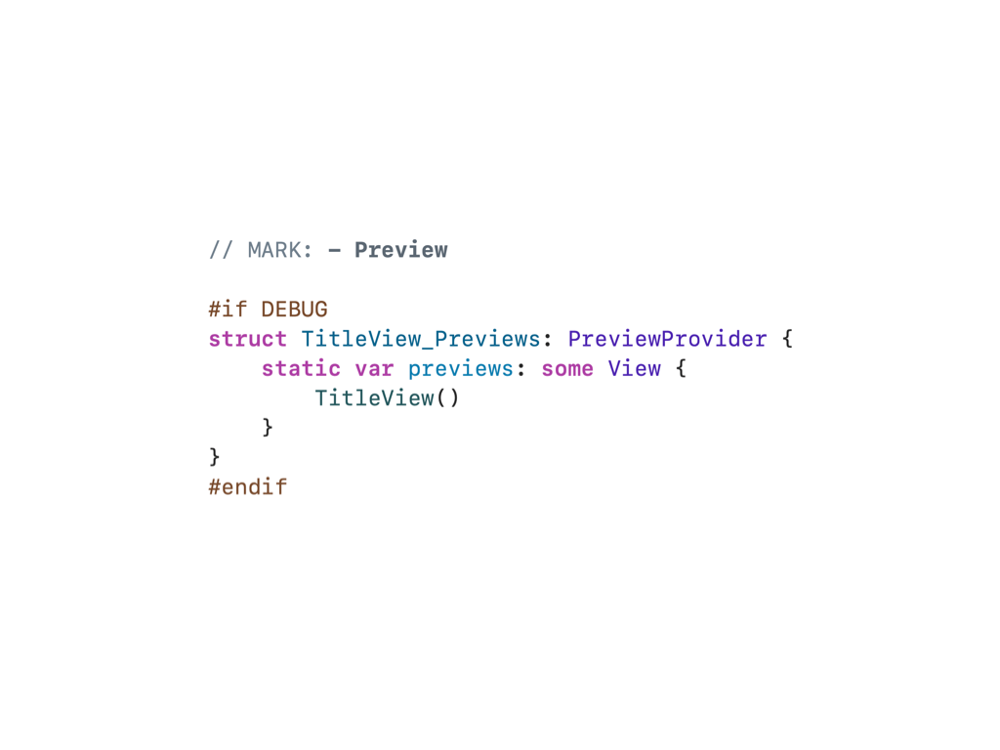
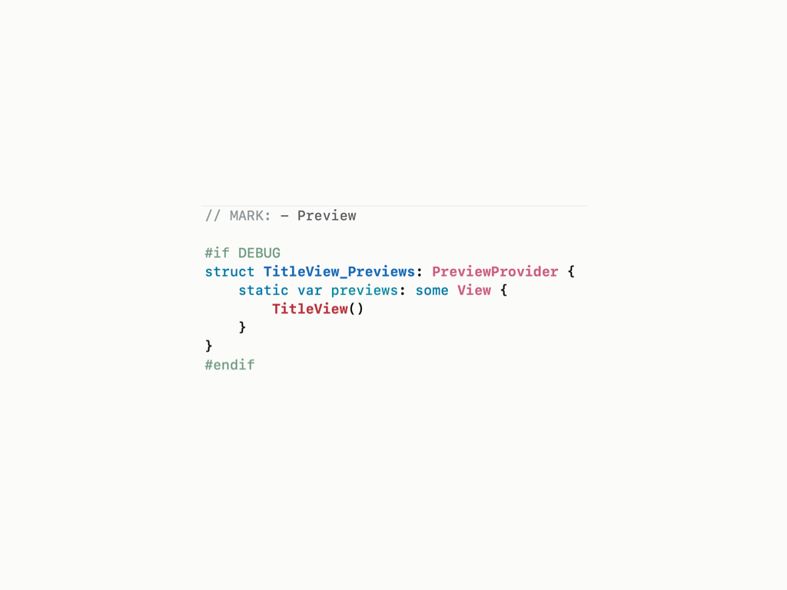

# Shibuya
## An Xcode Theme for SwiftUI

### Design Story

What it looks like:

I created this Xcode theme to solve some fundamental problems with the default Xcode theme, especially with SwiftUI.

Here are the problems:

## Problem 1: Too much emphasis on Keywords

In Xcode 11, the default light theme uses `SF Mono SemiBold` for Keywords and mostly `SF Mono Regular` for other components; the default dark theme uses `SF Mono Bold` for Keywords and mostly `SF Mono Medium` for other components.

In a pageful of codes, especially in a nested jungle of HStack, VStack, List, these bolded Keywords appears overwhelming. I believe Class, Type, and Method should be the first class citizens in syntax highlighting, because they varied a lot, while Keywords are merely repetitive companions.

In Shibuya theme, Class, Type, and Method take precedence over Keywords.

## Problem 2: Monotone syntax highlighting makes it difficult to differentiate Method Names and Instance Variables

SwiftUI has a heavy use of Method Names with Instance Variables side-by-side. In default Xcode theme, a whole chunk of code often appears monotone, affecting code clarity and readability.

In Shibuya theme, this chunk of code becomes instantly readable with clear hierarchy.

## Problem 3: Project declarations vs Other declarations are not instantly differentiable

In default Xcode theme, developers tend to lose focus in a sea of codes because everything appears flat with same importance. It is also hard to know whether a Class, Type, or Method was declared in framework or in the project itself.

In Shibuya theme, developers can instantly differentiate a framework Class, Type, Methods with a project one. The syntax highlighting are designed to be in adjacent colors: in above image, Other Class / Type Names are in dark pink, while Project Class / Type Names are in dark red.

# Installation

1. Clone or download the project as zip.
2. Copy Shibuya.xccolortheme into ~/Library/Developer/Xcode/UserData/FontAndColorThemes/
3. Restart XCode if theme does not appear in Preference.
4. Done! 🥂
