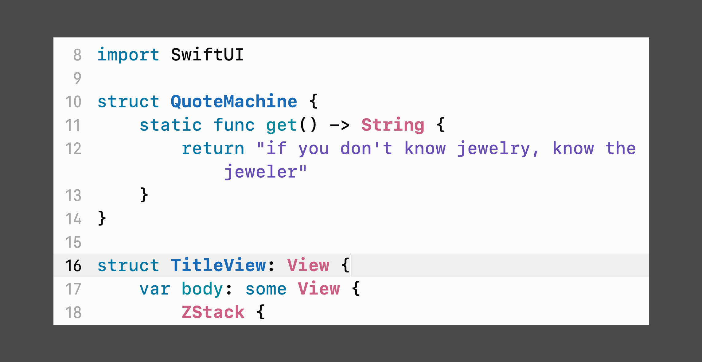
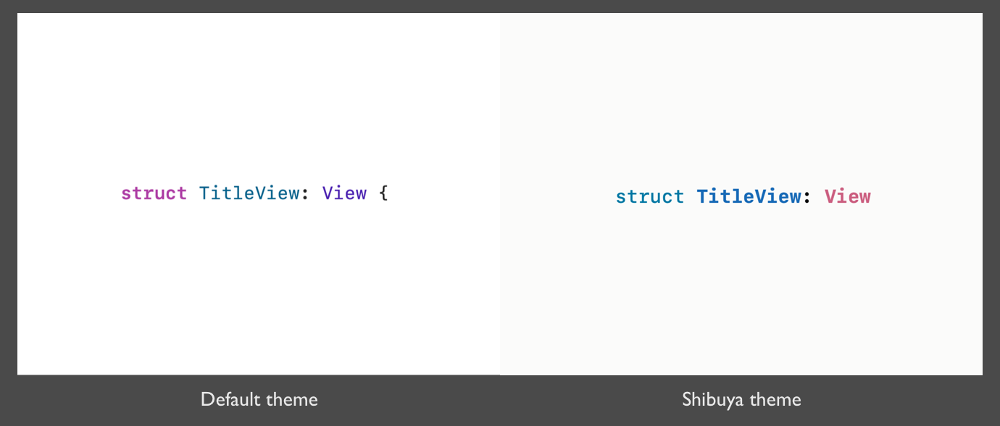
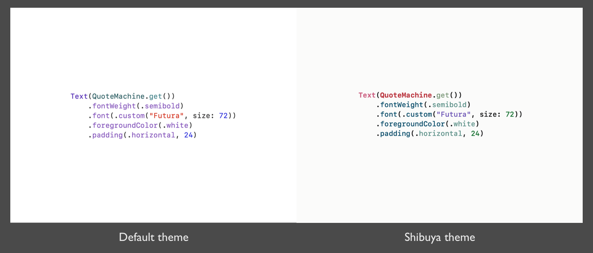
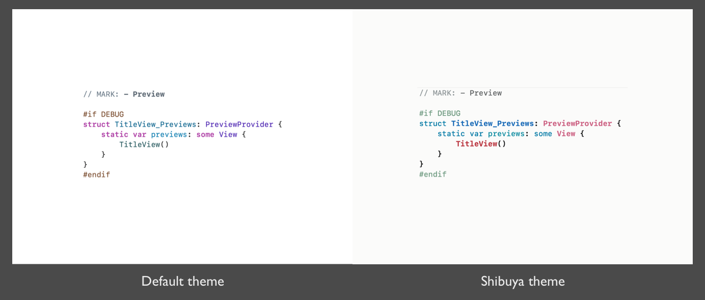

# Shibuya
## An Xcode Theme for SwiftUI

# Overview

# Design concepts
The Shibuya XCode theme was created to solve several shortfalls of the default XCode theme when highlighting SwiftUI source code.

## What are the issues with the default XCode theme?

### Issue 1: Over-emphasising Keywords

The default XCode them use bolded font for Keyword.

In SwiftUI, we often deal with a nested jungle of HStack, VStack, and List.

Since Keyword are often repetitive, Shibuya grants first-class citizens syntax highlighting for Class, Type, and Method, while giving Keyword a muted colour tone.

### Issue 2: Monotone

Compared to the chunk of monotone codes on the left, Shibuya brings clarity, hierarchy and structure.

As a programmer, the codes on the right give me a context what they are about.

### Issue 3: In-differentiable Project Declarations

There is a need to differentiate what codes are written by the team (Project Declarations) from what codes are provided by iOS frameworks (Other Declarations).

Shibuya renders these Declarations as Dark Red (Project Declaration) and Pale Pink (Other Declarations).

These adjacent colours give the impression that these codes are related yet different.

# Installation

1. Clone or download the project as zip.
2. Copy Shibuya.xccolortheme into ~/Library/Developer/Xcode/UserData/FontAndColorThemes/
3. Restart XCode if theme does not appear in Preference.
4. Done! 🥂
