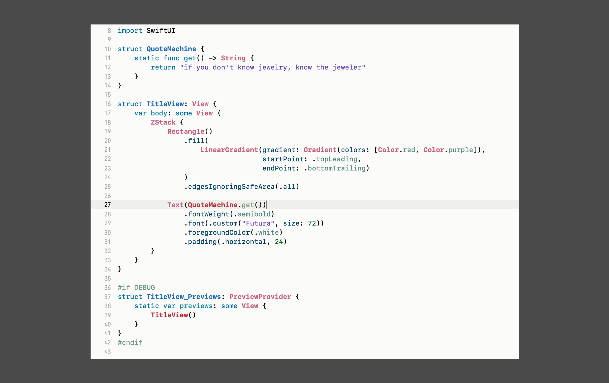

# Shibuya
## An Xcode Theme for SwiftUI

### Read the Design Story [here](https://www.cseanc.com/shibuya-an-xcode-theme-for-swiftui/).

#### What it looks like:

# Installation

1. Clone or download the project as zip.
2. Copy Shibuya.xccolortheme into ~/Library/Developer/Xcode/UserData/FontAndColorThemes/
3. Restart XCode if theme does not appear in Preference.
4. Done! 🥂
